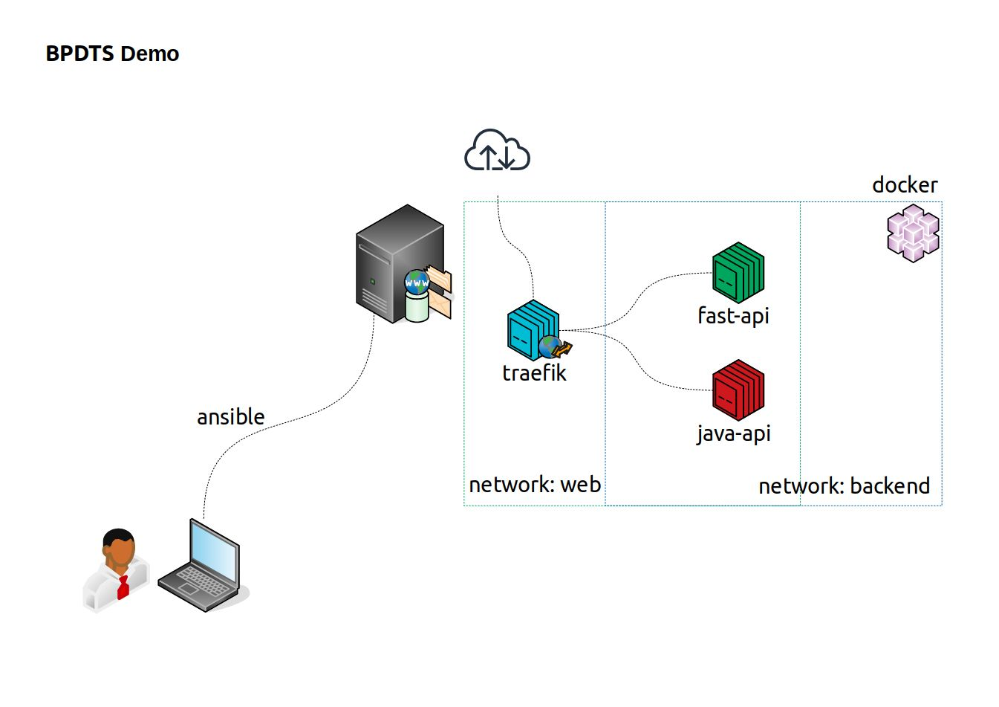

# BPDTS demo
The purpose of this project is to demonstrate how I would address the task described [here](http://bpdts-test-app-v4.herokuapp.com/instructions).

---
## Task
Build an API which calls this API, and returns people who are listed as either living in London, or whose current coordinates are within 60 miles of London.

### API
Source code can be found in `fast-api/main.py`. This single file REST server is my proposal to address the issue described in the task.

### Docker
`fast-api/Dockerfile` is used to build a custom image based on the official python3 image, installs the required packages and copy the application code.

---
## Deployment
An ansible playbook `ansible/` is used to copy a docker compose stack in the target host, build the application image, create 2 container replicas and start the service.

### Example
A running version of this code can be found in the link below

https://fast-api.cvbtechnology.com/docs

* **/london** : Get London Users
* **/within-london-radius** : Get Users within 60 mile radius from London

*_Original endpoints also exposed ( /instructions, /users, /city ... )_

The diagram below is a representation of how the example is set up in the target host.

The application is deployed in a multi-purpose server. The traefik container is a proxy server used to expose the fast-api example but it's covered in this repo.

---
## Notes
This project is a simple illustration of deployment based on the task given.

In a production scenario an good strategy would be using a managed Kubernetes cluster by a major cloud provider such as Amazon AWS or Azure.

Using AWS as an example, I would write Terraform scripts to set up the underling infrastructure (VPC, EKS, ...). Make sure security groups only exposes ports needed by the services, isolate instances in private subnets. On the application side, set up TLS comminication between services, check firewalls rules, etc

